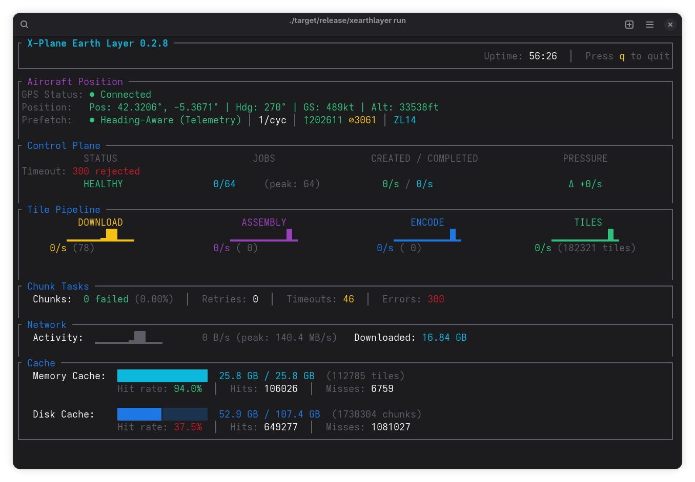
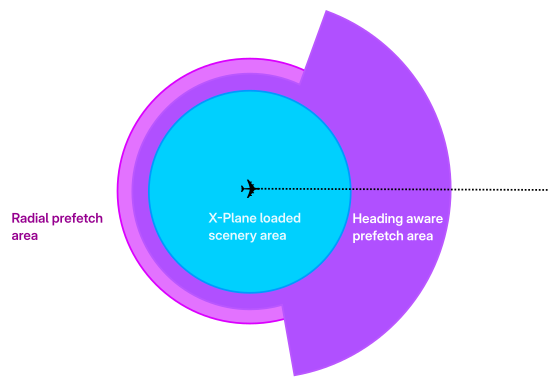

# XEarthLayer

High-quality satellite imagery for X-Plane, streamed on demand.


## What It Does

XEarthLayer delivers photo scenery to X-Plane without massive downloads. Instead of pre-downloading thousands of gigabytes of textures, XEarthLayer:

1. **Installs smaller regional packages** (tens of gigabytes) containing terrain detail
2. **Streams textures on-demand** as you fly, downloading satellite imagery from a variety of providers

The result: complete orthophoto scenery with less overall disk usage implemented in a fast, modern, memory safe language.

## How It Works

```
Regional Package (base data)      XEarthLayer Service (running)
┌────────────────────────┐        ┌────────────────────────┐
│ Terrain definitions    │        │ Satellite Providers    │
│ (DSF, TER files)       │───────→│ (Bing, Google, Apple,  │
│ References textures    │        │  ArcGIS, MapBox, USGS) │
│ for download           │        │                        │
└────────────────────────┘        │ Generates DDS textures │
                                  │ on-demand              │
                                  └────────────────────────┘
                                             │
                                             ▼
                                  ┌────────────────────────┐
                                  │ X-Plane sees complete  │
                                  │ scenery with textures  │
                                  └────────────────────────┘
```

See [How It Works](docs/how-it-works.md) for detailed architecture.

## Features

- Small regional packages (gigabytes, not terrabytes)
- On-demand texture streaming from multiple providers:
  - **Bing Maps** - Free, global coverage (recommended)
  - **Google Maps** - Via GO2 (free) or official API (paid)
  - **Apple Maps** - High quality, auto-acquires tokens
  - **ArcGIS** - Free, global coverage
  - **MapBox** - Requires access token
  - **USGS** - Free, US coverage only
- **Predictive prefetching** - Tiles loaded ahead of your flight path
  - Heading-aware cone prefetching using X-Plane telemetry
  - Multi-zoom support (ZL14 near, ZL12 distant)
  - Scenery-aware indexing for exact tile lookup
  - Graceful degradation when telemetry unavailable
- Two-tier caching for instant repeat visits
- High-quality BC1/BC3 DDS textures with mipmaps
- Real-time dashboard showing cache, download, and prefetch status
- Works with Ortho4XP-generated scenery
- Linux support

## Quick Start

```bash
# Build from source
git clone https://github.com/samsoir/xearthlayer.git
cd xearthlayer
make release

# Initialize configuration
xearthlayer init

# Configure your package library in ~/.xearthlayer/config.ini:
# [packages]
library_url = https://raw.githubusercontent.com/samsoir/xearthlayer-regional-scenery/main/xearthlayer_package_library.txt

# Install a regional package
xearthlayer packages install eu

# Start XEarthLayer (mounts all installed packages automatically)
xearthlayer run

# Fly!
```

See [Getting Started](docs/getting-started.md) for the complete guide.

### Real-Time Dashboard

XEarthLayer provides a real-time terminal dashboard showing cache status, download activity, and prefetch progress:



## XEarthLayer Regional Scenery Package Project

XEarthLayer requires regional scenery packages to be installed in order for it to work. XEarthLayer is creating a regional package library for general public use. It is possible for anyone to create and publish their own package server.

[XEarthLayer Scenery Packages](https://github.com/samsoir/xearthlayer-regional-scenery) are hosted on Github.

## Predictive Prefetching

XEarthLayer reduces FPS drops by prefetching tiles ahead of your aircraft using a dual-zone system:



For best results:

1. **Enable ForeFlight telemetry** in X-Plane:
   - Settings → Network → Enable "Send to ForeFlight"
   - XEarthLayer receives position/heading on UDP port 49002

2. **Prefetch modes** (automatic selection):
   - **Telemetry mode**: Precise cone-based prefetching using heading data
   - **FUSE inference**: Infers position from file access patterns when telemetry is stale
   - **Radial fallback**: Simple 7×7 grid when no heading data available

The dashboard shows real-time prefetch status: `Prefetch: Telemetry | 23/cycle | Cache: 156↑ TTL: 8⊘ | ZL14 ZL12`

See [Configuration](docs/configuration.md#prefetch) and [Predictive Caching Design](docs/dev/predictive-caching.md) for tuning options.

## Documentation

### User Guides

| Guide | Description |
|-------|-------------|
| [How It Works](docs/how-it-works.md) | Architecture and system overview |
| [Getting Started](docs/getting-started.md) | First-time setup and usage |
| [Configuration](docs/configuration.md) | All configuration options |
| [Package Management](docs/package-management.md) | Installing, updating, removing packages |
| [Running the Service](docs/running-service.md) | Streaming service options |
| [Content Publishing](docs/content-publishing.md) | Create packages from Ortho4XP |

### Developer Documentation

See [Developer Documentation](docs/dev/) for architecture, design principles, and implementation details.

## CLI Reference

```bash
# Setup
xearthlayer init                      # Create config file

# Package Management
xearthlayer packages check            # Check available packages
xearthlayer packages install <region> # Install a package
xearthlayer packages list             # List installed packages
xearthlayer packages update [region]  # Update packages
xearthlayer packages remove <region>  # Remove a package

# Running (primary command)
xearthlayer run                       # Mount all packages and start streaming (with real-time dashboard)

# Advanced: Single Package Mode
xearthlayer start --source <path>     # Start streaming for a single scenery pack

# Cache Management
xearthlayer cache stats               # View cache usage
xearthlayer cache clear               # Clear cache

# Content Publishing
xearthlayer publish init              # Initialize repository
xearthlayer publish add --source <path> --region <code>  # Create package
xearthlayer publish build --region <code>   # Build archives
xearthlayer publish release --region <code> # Release to library
```

Run `xearthlayer --help` for all options.

## Requirements

- **X-Plane 12**
- **Linux** with FUSE support
- **Modern GPU** with 8GB VRAM or higher, 16GB+ recommended
- **Fast Internet connection** for streaming imagery, recommended 800Mbps downstream or better

XEarthLayer is not tested with X-Plane 11, but should work in principle. The scenery packages that are provided by this project are designed for X-Plane 12 only. XEarthLayer using regional scenery packages published for X-Plane 11 should work without issue, your mileage may vary.

## Contributing

```bash
# Install Rust via rustup.rs
curl --proto '=https' --tlsv1.2 -sSf https://sh.rustup.rs | sh

# Clone and build
git clone https://github.com/samsoir/xearthlayer.git
cd xearthlayer
make init
make verify
```

See [Developer Documentation](docs/dev/) for architecture and guidelines.

## Credits

Architecturally influenced by [AutoOrtho](https://github.com/kubilus1/autoortho) by [kubilus1](https://github.com/kubilus1). XEarthLayer is an independent Rust implementation focused on performance and memory safety.

XEarthLayer Regional Scenery Packages created using [Shred86 fork of Ortho4XP](https://github.com/shred86/Ortho4XP)

Developed with assistance from [Claude](https://claude.ai) by Anthropic.

Made with :heart: in California.

## License

Licensed under the MIT License. See [LICENSE](LICENSE) for details.
