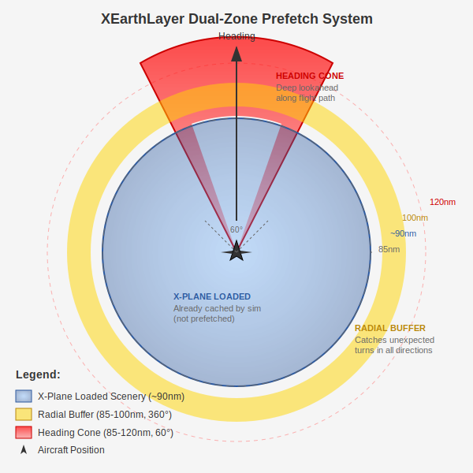

# Heading-Aware Prefetch Design

## Status: Implemented (Phases 1-4 Complete, Dual-Zone v0.2.9)
**Author**: Sam de Freyssinet & Claude Code
**Date**: 2025-12-25 (updated 2025-12-28)
**Related**: `docs/dev/predictive-caching.md`

---

## 1. Problem Statement

### Current Behavior
The existing `RadialPrefetcher` uses a symmetric 7×7 grid (49 tiles) centered on the aircraft's current position. This approach:

- Wastes prefetch budget on tiles **behind** the aircraft
- Provides insufficient lookahead at **high speeds**
- Causes **stutter during flight** when tiles aren't ready in time

### Observed Symptoms
During a 2-hour flight test:
- Minor stuttering when XEL fetches tiles from network
- Tiles not returned fast enough for seamless sim experience
- Timeouts and errors compound the issue (10s timeout → 60s TTL block)

---

## 2. Experimental Findings

### 2.1 X-Plane Initial Load Analysis (LFBO Cold Start)

| Metric | Value |
|--------|-------|
| Tiles loaded (zoom 12) | 2,256 |
| Tiles loaded (zoom 14) | 411 |
| Total tiles | 2,667 |
| Total chunks | 682,752 |
| Cache size | 12 GB |
| Geographic radius | ~90 nm (168 km) |
| Grid dimensions | 48 × 47 tiles |

### 2.2 Flight Test: LFBO → 25nm NW (Heading 321°)

**Test conditions:**
- Departure: LFBO RWY 32 (heading 321°)
- Distance flown: 25 nm
- Altitude: FL152
- Straight-line flight (no turns)

**Results:**

| Metric | Before Flight | After 25nm | Delta |
|--------|---------------|------------|-------|
| Zoom 12 tiles | 2,256 | 2,256 | **0** |
| Zoom 14 tiles | 411 | 1,109 | **+698** |
| Total tiles | 2,667 | 3,365 | +698 |

**Note: At 25nm, we observed zero new Z12 tiles. See §2.3 for what happens at 45nm.**

### 2.3 Complete Flight Test: LFBO → 115nm NW

**Full flight profile:**
- Departure: LFBO RWY 32 (heading 321°)
- Cruise altitude: FL220-226
- Distance: 115 nm straight-line
- Provider: Apple Maps

**Complete tile loading data:**

| Distance | Z12 Tiles | Z14 Tiles | Total | Δ Z12 | Δ Z14 | Notes |
|----------|-----------|-----------|-------|-------|-------|-------|
| 0nm | 2,256 | 411 | 2,667 | — | — | Startup load |
| 25nm | 2,256 | 1,109 | 3,365 | +0 | +698 | Within preload circle |
| 45nm | 3,007 | 1,525 | 4,532 | +751 | +416 | First Z12 extension |
| 70nm | 3,007 | 1,933 | 4,940 | +0 | +408 | Z12 stable |
| 90nm | 3,223 | 2,440 | 5,663 | +216 | +507 | At circle boundary |
| 115nm | 3,540 | 2,932 | 6,472 | +317 | +492 | Beyond boundary |

**Z12 Loading Pattern Discovered:**
```
0-25nm:   No loading (within 90nm startup circle)
25-45nm:  +751 tiles (preemptive extension at ~50% of radius)
45-70nm:  No loading (extension still sufficient)
70-90nm:  +216 tiles (approaching original boundary)
90-115nm: +317 tiles (continuous loading beyond boundary)
```

**Z14 Loading Rate:**
- 0-25nm: ~28 tiles/nm (high-detail local area)
- 25-70nm: ~16-18 tiles/nm (transitioning to cruise view)
- 70-115nm: ~20-25 tiles/nm (steady cruise rate)
- **Average: ~22 tiles/nm at cruise altitude**

**Key Insight:** Beyond the 90nm startup circle, BOTH zoom levels load
continuously, making prefetch critical for long-haul flights.

### 2.4 Two-Tier Tile Loading Strategy (Refined)

X-Plane uses different loading strategies per zoom level:

```
┌─────────────────────────────────────────────────────────────────────┐
│  ZOOM 12 (Base Layer) - "Safety Net"                                │
│  ────────────────────────────────────                               │
│  • Preloaded at startup as ~90nm radius circle                      │
│  • Extended when aircraft approaches circle edge (~45nm from start) │
│  • Lower priority - extends in chunks when needed                   │
│  • Prefetch priority: LOW (background loading acceptable)           │
├─────────────────────────────────────────────────────────────────────┤
│  ZOOM 14 (Detail Layer) - "Active View"                             │
│  ─────────────────────────────────────                              │
│  • Loaded DYNAMICALLY during flight as sliding window               │
│  • Follows aircraft position continuously                           │
│  • THIS IS WHERE STUTTER OCCURS                                     │
│  • Prefetch priority: HIGH (must stay ahead of aircraft)            │
└─────────────────────────────────────────────────────────────────────┘
```

### 2.5 New Tile Distribution Analysis (25nm Flight)

The 698 new zoom 14 tiles formed a distinctive pattern:

| Metric | Value |
|--------|-------|
| Row range | 5947-5986 (40 rows) |
| Column range | 8226-8260 (35 columns) |
| Bearing from LFBO | ~323° |
| Flight heading | 321° |
| Alignment error | 2° |

**Visual representation:**
```
                    Flight Path (321°)
                          ↑
                    ┌─────────────┐
                   ╱               ╲
                  ╱   NEW TILES     ╲
                 ╱    (698 z14)      ╲  ← Elongated forward cone
                ╱                     ╲
              ├─────────────────────────┤
              │                         │
              │   STARTUP TILES         │ ← 90nm base layer
              │   (411 z14 + 2256 z12)  │
              │                         │
              └─────────────────────────┘
                        ✈
                       LFBO
```

### 2.6 Key Insight (Refined)

The sliding window hypothesis is **CONFIRMED** with refinements:

**Zoom 14 (Primary concern for stutter):**
- Dynamically loaded as narrow band ahead of aircraft
- New tiles tightly align with flight heading (2° error)
- ~28 tiles per nautical mile of travel
- **Prefetch priority: CRITICAL**

**Zoom 12 (Secondary concern):**
- Initially static 90nm base coverage
- Extended when aircraft reaches ~45nm from origin
- Loaded in larger chunks (751 tiles at once)
- **Prefetch priority: LOW** (can be background-loaded)

### 2.7 Implications for Prefetch Strategy

1. **Primary focus: Zoom 14** - This is where stutter occurs
2. **Secondary focus: Zoom 12** - Background prefetch when >30nm from origin
3. **Narrow forward cone** - New tiles align within ~5° of heading
4. **~28 Z14 tiles/nm travel** - Use this to calibrate prefetch budget
5. **RadialPrefetcher operates at zoom 14** - Already correct zoom level

### 2.8 Speed Considerations

At cruise speeds:
- **450 kt**: Aircraft moves 7.5 nm/min (0.125 nm/sec)
- **Tile download**: 2-3 seconds typical
- **Required buffer**: ~0.4 nm minimum (3 tiles at zoom 14)
- **Safe lookahead**: 5-10 nm ahead for margin

---

### 2.9 Gap Analysis (Revised)

| Aspect | X-Plane Behavior | Current Prefetch | Gap |
|--------|------------------|------------------|-----|
| Zoom 12 | Static 90nm + extends at ~45nm | Not handled | Background prefetch at distance |
| Zoom 14 | Dynamic sliding window | Symmetric 7×7 grid | **Directionality** |
| Lookahead | ~10-15nm ahead of aircraft | ~4 nm symmetric | **+6-11 nm forward** |
| Tiles/cycle | ~28 Z14 tiles/nm traveled | 49 tiles (many wasted) | **Efficiency** |

### 2.10 Recently-Cached Tile Exclusion (Inner Radius)

As the aircraft flies, X-Plane continuously requests tiles via FUSE to fill its
~90nm viewing range (see §2.1-2.3). Tiles immediately around the aircraft have
typically **already been requested and cached**. Prefetching these tiles is
redundant - they're already in our cache from recent FUSE requests.

**Tile Request Flow:**

```
┌─────────────────────────────────────────────────────────────────────────────┐
│  RECENTLY-CACHED ZONE (tiles X-Plane has already requested)                 │
│  ──────────────────────────────────────────────────────────                 │
│  • Tiles behind and immediately around the aircraft                         │
│  • Already fetched via FUSE requests → in our cache                         │
│  • Prefetching here is REDUNDANT (cache hit anyway)                         │
│  • Configured via `inner_radius_nm`                                         │
├─────────────────────────────────────────────────────────────────────────────┤
│  PREFETCH TARGET ZONE (ahead of aircraft, not yet requested)                │
│  ───────────────────────────────────────────────────────────                │
│  • Tiles X-Plane will request as aircraft moves forward                     │
│  • NOT yet in cache → this is where stutter occurs                          │
│  • Our prefetch should populate cache HERE before X-Plane asks              │
└─────────────────────────────────────────────────────────────────────────────┘
```

**Note:** X-Plane maintains a ~90nm radius of loaded ZL14 tiles around the aircraft.
Our prefetch zone targets the ring *around* this boundary—prefetching tiles just
before X-Plane needs them and extending beyond where it currently loads.

**Solution: Dual-Zone Prefetch System (v0.2.9+)**



Instead of a single annular cone, we use a **dual-zone system** that combines:
1. A 360° **radial buffer** around X-Plane's boundary
2. A forward **heading cone** for deep lookahead

```
                              Heading
                                 ↑
                           ┌─────────────┐
                          ╱   HEADING     ╲
                         ╱     CONE        ╲         ← 85-120nm forward
                        ╱   (60° wide)      ╲          (35nm deep lookahead)
                       ╱                     ╲
          ┌───────────┴───────────────────────┴───────────┐
          │              RADIAL BUFFER (360°)             │ ← 85-100nm
          │  ┌───────────────────────────────────────┐    │   (15nm wide ring)
          │  │                                       │    │
          │  │       X-PLANE LOADED SCENERY          │    │
          │  │          (~90nm radius)               │    │
          │  │                                       │    │
          │  │              ✈ Aircraft               │    │
          │  │                                       │    │
          │  └───────────────────────────────────────┘    │
          └───────────────────────────────────────────────┘
```

**Key Parameters:**

| Parameter | Default | Purpose |
|-----------|---------|---------|
| `XPLANE_LOADED_ZONE_NM` | 90.0 nm | X-Plane's loaded tile radius (constant) |
| `inner_radius_nm` | 85.0 nm | Where both zones START (5nm margin inside boundary) |
| `radial_outer_radius_nm` | 100.0 nm | Outer edge of 360° radial buffer |
| `cone_outer_radius_nm` | 120.0 nm | Outer edge of forward heading cone |
| `cone_half_angle` | 30.0° | Half-angle of cone (60° total width) |

**Radial Buffer (85-100nm, 360°):**
- Covers all directions for unexpected turns, orbits, and course changes
- 15nm wide ring around X-Plane's boundary
- Lower priority than heading cone tiles

**Heading Cone (85-120nm, 60° forward):**
- Deep lookahead along the flight path (35nm beyond boundary)
- Highest priority for smooth forward flight
- Narrows to 60° total width to focus on flight direction

**Both zones run every cycle:** Tiles are combined and deduplicated via request coalescing.
The dual-zone approach catches unexpected turns while providing deep forward coverage.

---

## 3. Proposed Solution: Heading-Weighted Lookahead Prefetch

### Core Concept

Replace the symmetric radial grid with a **directional cone** that prioritizes tiles in the aircraft's flight path:

```
        Current Radial (7×7)              Heading-Aware Cone

            · · · · · · ·                      · · ·
            · · · · · · ·                    · · · · ·
            · · · · · · ·                  · · · · · · ·
            · · · ✈ · · ·                · · · · · · · · ·
            · · · · · · ·                  · · · ✈ · · ·
            · · · · · · ·                    · · · · ·
            · · · · · · ·                      · · ·
                                                 ↑
        49 tiles symmetric              ~40-50 tiles directional
        (many wasted behind)            (focused ahead)
```

### Algorithm Overview

1. **Calculate lookahead distance** based on ground speed
2. **Project future positions** along current heading
3. **Generate tiles in cone** ahead of aircraft (configurable angle)
4. **Add minimal buffer** behind for turns/reversals
5. **Priority order** by distance (nearest first)

---

## 4. Detailed Design

### 4.1 Configuration Parameters

```rust
pub struct HeadingAwarePrefetchConfig {
    // === Dual-Zone Boundaries (v0.2.9+) ===

    /// Inner radius in nautical miles - where both zones START.
    /// Set 5nm inside X-Plane's ~90nm boundary to ensure tiles are ready.
    /// (default: 85.0 nm)
    pub inner_radius_nm: f32,

    /// Outer radius for the 360° radial buffer.
    /// Covers all directions for unexpected turns.
    /// (default: 100.0 nm = 10nm beyond X-Plane's boundary)
    pub radial_outer_radius_nm: f32,

    /// Outer radius for the forward heading cone.
    /// Deep lookahead along flight path.
    /// (default: 120.0 nm = 30nm beyond X-Plane's boundary)
    pub cone_outer_radius_nm: f32,

    // === Cone Geometry ===

    /// Cone half-angle in degrees (default: 30° = 60° total cone)
    pub cone_half_angle: f32,

    /// Minimum lookahead distance in nautical miles (default: 5.0)
    pub min_lookahead_nm: f32,

    /// Maximum lookahead distance in nautical miles (default: 15.0)
    pub max_lookahead_nm: f32,

    /// Lookahead time in seconds - distance = speed × time (default: 60)
    pub lookahead_time_secs: f32,

    // === Buffers ===

    /// Tiles to keep behind aircraft for turn recovery (default: 3)
    pub rear_buffer_tiles: u8,

    /// Angle for lateral buffers in degrees from cone edge (default: 45.0)
    pub lateral_buffer_angle: f32,

    /// Depth of lateral buffer in tiles (default: 3)
    pub lateral_buffer_depth: u8,

    // === General ===

    /// Maximum tiles per prefetch cycle (default: 50)
    pub max_tiles_per_cycle: usize,

    /// TTL for failed tile attempts (default: 60s)
    pub attempt_ttl: Duration,
}

impl Default for HeadingAwarePrefetchConfig {
    fn default() -> Self {
        Self {
            // Dual-zone boundaries
            inner_radius_nm: 85.0,
            radial_outer_radius_nm: 100.0,
            cone_outer_radius_nm: 120.0,
            // Cone geometry
            cone_half_angle: 30.0,
            min_lookahead_nm: 5.0,
            max_lookahead_nm: 15.0,
            lookahead_time_secs: 60.0,
            // Buffers
            rear_buffer_tiles: 3,
            lateral_buffer_angle: 45.0,
            lateral_buffer_depth: 3,
            // General
            max_tiles_per_cycle: 50,
            attempt_ttl: Duration::from_secs(60),
        }
    }
}
```

**Configuration via config.ini:**

```ini
[prefetch]
inner_radius_nm = 85              # 5nm inside X-Plane's 90nm boundary
radial_outer_radius_nm = 100      # 360° buffer extends 10nm beyond
cone_outer_radius_nm = 120        # Forward cone extends 30nm beyond
cone_half_angle = 30              # 60° total cone width
```

**Effective Prefetch Zone Calculation:**

```rust
fn effective_inner_radius(&self) -> f32 {
    // Start prefetching slightly inside the inner radius for safety margin
    (self.inner_radius_nm - self.overlap_margin_nm).max(0.0)
}

fn should_prefetch_tile(&self, distance_nm: f32) -> bool {
    let effective_inner = self.effective_inner_radius();
    distance_nm >= effective_inner && distance_nm <= self.max_lookahead_nm
}
```

### 4.2 Lookahead Distance Calculation

```rust
fn calculate_lookahead_nm(&self, ground_speed_kt: f32) -> f32 {
    // Convert speed to nm/sec, multiply by lookahead time
    let speed_nm_per_sec = ground_speed_kt / 3600.0;
    let dynamic_lookahead = speed_nm_per_sec * self.config.lookahead_time_secs;

    // Clamp to configured bounds
    dynamic_lookahead
        .max(self.config.min_lookahead_nm)
        .min(self.config.max_lookahead_nm)
}
```

**Example calculations:**

| Ground Speed | Lookahead (60s) | Clamped |
|--------------|-----------------|---------|
| 100 kt | 1.7 nm | 5.0 nm (min) |
| 250 kt | 4.2 nm | 5.0 nm (min) |
| 450 kt | 7.5 nm | 7.5 nm |
| 600 kt | 10.0 nm | 10.0 nm |
| 900 kt | 15.0 nm | 15.0 nm (max) |

### 4.3 Cone Tile Generation

```rust
fn generate_cone_tiles(
    &self,
    position: (f64, f64),      // (lat, lon)
    heading: f32,              // degrees true
    lookahead_nm: f32,
) -> Vec<TileCoord> {
    let mut tiles = Vec::new();
    let mut seen = HashSet::new();

    // Convert lookahead to tile units at this zoom level
    let tile_size_nm = self.tile_size_nm_at_lat(position.0);
    let lookahead_tiles = (lookahead_nm / tile_size_nm).ceil() as i32;

    // Current tile
    let center_tile = lat_lon_to_tile(position.0, position.1, self.config.zoom);

    // Generate rays within cone
    let half_angle = self.config.cone_half_angle;
    for angle_offset in [-half_angle, -half_angle/2.0, 0.0, half_angle/2.0, half_angle] {
        let ray_heading = (heading + angle_offset).rem_euclid(360.0);

        // Walk along ray
        for distance in 1..=lookahead_tiles {
            let (lat, lon) = self.project_position(
                position,
                ray_heading,
                distance as f32 * tile_size_nm,
            );
            let tile = lat_lon_to_tile(lat, lon, self.config.zoom);

            if seen.insert((tile.row, tile.col)) {
                tiles.push(tile);
            }
        }
    }

    // Fill in the cone (not just rays)
    tiles = self.fill_cone_tiles(center_tile, heading, lookahead_tiles, half_angle);

    // Add rear buffer
    self.add_rear_buffer(&mut tiles, center_tile, heading);

    // Sort by distance (priority: nearest first)
    tiles.sort_by_key(|t| self.tile_distance(center_tile, *t));

    // Limit to max tiles
    tiles.truncate(self.config.max_tiles_per_cycle);

    tiles
}
```

### 4.4 Priority Ordering

Tiles are prioritized by:

1. **Distance from aircraft** (nearest first)
2. **Alignment with heading** (center of cone > edges)
3. **Cache status** (uncached > cached)

```rust
fn calculate_priority(&self, tile: TileCoord, aircraft: &AircraftState) -> u32 {
    let distance = self.tile_distance_nm(aircraft.position(), tile);
    let angle_offset = self.angle_from_heading(aircraft, tile).abs();

    // Lower score = higher priority
    let distance_score = (distance * 100.0) as u32;
    let angle_score = (angle_offset * 10.0) as u32;

    distance_score + angle_score
}
```

---

## 5. Vector Change Buffering

### 5.1 Problem: Unexpected Heading Changes

Aircraft don't always fly straight. Turns, course corrections, and ATC vectors
can invalidate a purely forward-focused prefetch cone. Without buffering:

- 90° turn at 450kt = tiles needed in ~30 seconds that weren't prefetched
- Standard rate turn (3°/sec) = 30 seconds to complete 90° turn
- At 7.5nm/min cruise = 3.75nm traveled during turn

### 5.2 Turn Anticipation Strategy

```
                    Forward Cone (primary)
                          ↑
                    ┌─────────────┐
                   ╱               ╲
                  ╱                 ╲
         ←──────╱                   ╲──────→
        Left   ╱                     ╲   Right
        Buffer╱                       ╲  Buffer
             ╱                         ╲
            ├───────────┬───────────────┤
                        ✈
                   Rear Buffer
```

### 5.3 Buffer Configuration

```rust
pub struct VectorBufferConfig {
    /// Lateral buffer angle beyond cone (default: 45°)
    /// Adds coverage for turns up to this angle without re-fetch
    pub lateral_buffer_angle: f32,

    /// Lateral buffer depth in tiles (default: 3)
    /// How many tiles deep the lateral buffer extends
    pub lateral_buffer_depth: u8,

    /// Rear buffer tiles (default: 3)
    /// Coverage behind aircraft for reversals/orbits
    pub rear_buffer_tiles: u8,

    /// Turn detection threshold in degrees/second (default: 1.0)
    /// If turn rate exceeds this, widen the cone temporarily
    pub turn_rate_threshold: f32,

    /// Dynamic cone widening factor (default: 1.5)
    /// Multiply cone angle by this during detected turns
    pub turn_widening_factor: f32,
}
```

### 5.4 Turn Detection Algorithm

```rust
fn detect_turn(&mut self, current_heading: f32, timestamp: Instant) -> TurnState {
    let dt = timestamp.duration_since(self.last_update).as_secs_f32();
    let heading_delta = (current_heading - self.last_heading).abs();

    // Normalize for 359° → 1° wrap
    let heading_delta = if heading_delta > 180.0 { 360.0 - heading_delta } else { heading_delta };

    let turn_rate = heading_delta / dt;  // degrees per second

    self.last_heading = current_heading;
    self.last_update = timestamp;

    if turn_rate > self.config.turn_rate_threshold {
        // Apply exponential smoothing to avoid jitter
        self.smoothed_turn_rate = 0.3 * turn_rate + 0.7 * self.smoothed_turn_rate;

        if self.smoothed_turn_rate > self.config.turn_rate_threshold {
            return TurnState::Turning {
                rate: self.smoothed_turn_rate,
                direction: if current_heading > self.last_heading { TurnDirection::Right } else { TurnDirection::Left },
            };
        }
    }

    TurnState::Straight
}
```

### 5.5 Adaptive Cone During Turns

When a turn is detected:

1. **Widen the cone** by `turn_widening_factor` (30° → 45°)
2. **Bias toward turn direction** (shift cone center 15° into turn)
3. **Increase lateral buffer** on turn side
4. **Maintain for 10 seconds** after turn rate drops (anticipate rollout)

```rust
fn calculate_effective_cone(&self, base_config: &HeadingAwarePrefetchConfig) -> ConeParameters {
    match self.turn_state {
        TurnState::Straight => ConeParameters {
            half_angle: base_config.cone_half_angle,
            center_offset: 0.0,
        },
        TurnState::Turning { rate, direction } => {
            let widening = (rate / 3.0).min(1.0);  // Scale 0-1 for 0-3°/sec
            ConeParameters {
                half_angle: base_config.cone_half_angle * (1.0 + widening * 0.5),
                center_offset: match direction {
                    TurnDirection::Left => -15.0 * widening,
                    TurnDirection::Right => 15.0 * widening,
                },
            }
        }
    }
}
```

### 5.6 Buffer Tile Priority

Buffer tiles are lower priority than forward cone tiles:

| Zone | Priority | Description |
|------|----------|-------------|
| Forward cone center | 1 (highest) | Directly ahead on heading |
| Forward cone edges | 2 | Within cone but off-center |
| Lateral buffer (turn side) | 3 | Turn anticipation |
| Lateral buffer (opposite) | 4 | Coverage for unexpected turns |
| Rear buffer | 5 (lowest) | Reversal/orbit protection |

---

## 6. Telemetry-Free Prefetch (FUSE-Based Inference)

### 6.1 Problem: No XGPS2 Data Available

Not all users enable X-Plane's XGPS2 UDP broadcast, and some X-Plane versions
or configurations may not support it. We need a fallback that works without
any external telemetry source.

### 6.2 Solution: Infer Position from FUSE Requests

X-Plane's tile requests through FUSE reveal the aircraft's approximate position
and heading. By analyzing the pattern of requested tiles, we can infer:

1. **Current position** — Center of recently requested tile cluster
2. **Heading** — Direction of the "leading edge" of requests
3. **Speed** — Rate at which the leading edge advances

```
Time T:     ○ ○ ○ ○ ○        Time T+5s:  · · ○ ○ ○ ○ ○
            ○ ○ ● ○ ○                    · · ○ ● ○ ○ ○
            ○ ○ ○ ○ ○                    · · ○ ○ ○ ○ ○
                ↑                              ↑
            Aircraft                    Aircraft moved NE

● = Most recent request    ○ = Recent requests    · = Old (no longer requested)

Inferred heading: Northeast (~45°)
Inferred speed: ~2 tiles per 5 seconds
```

### 6.3 Request Pattern Analyzer

```rust
pub struct FuseRequestAnalyzer {
    /// Recent tile requests with timestamps
    recent_requests: VecDeque<(TileCoord, Instant)>,

    /// Maximum age of requests to consider (default: 30s)
    max_request_age: Duration,

    /// Minimum requests needed for inference (default: 10)
    min_requests_for_inference: usize,

    /// Inferred aircraft state
    inferred_state: Option<InferredAircraftState>,
}

pub struct InferredAircraftState {
    pub position: (f64, f64),      // Estimated lat/lon
    pub heading: f32,              // Estimated heading (degrees)
    pub ground_speed_kt: f32,      // Estimated speed
    pub confidence: f32,           // 0.0 - 1.0
    pub last_update: Instant,
}
```

### 6.4 Inference Algorithm

```rust
impl FuseRequestAnalyzer {
    pub fn record_request(&mut self, tile: TileCoord) {
        let now = Instant::now();

        // Add new request
        self.recent_requests.push_back((tile, now));

        // Prune old requests
        while let Some((_, ts)) = self.recent_requests.front() {
            if now.duration_since(*ts) > self.max_request_age {
                self.recent_requests.pop_front();
            } else {
                break;
            }
        }

        // Update inference if we have enough data
        if self.recent_requests.len() >= self.min_requests_for_inference {
            self.update_inference();
        }
    }

    fn update_inference(&mut self) {
        // 1. Find centroid of recent requests (= approximate position)
        let (sum_row, sum_col, count) = self.recent_requests.iter()
            .fold((0i64, 0i64, 0i64), |(r, c, n), (tile, _)| {
                (r + tile.row as i64, c + tile.col as i64, n + 1)
            });
        let center_row = (sum_row / count) as u32;
        let center_col = (sum_col / count) as u32;

        // 2. Find the "leading edge" - most recently requested tiles
        let recent_threshold = Instant::now() - Duration::from_secs(5);
        let leading_edge: Vec<_> = self.recent_requests.iter()
            .filter(|(_, ts)| *ts > recent_threshold)
            .map(|(tile, _)| tile)
            .collect();

        // 3. Calculate vector from center to leading edge centroid
        if leading_edge.len() >= 3 {
            let (edge_row, edge_col) = leading_edge.iter()
                .fold((0i64, 0i64), |(r, c), tile| {
                    (r + tile.row as i64, c + tile.col as i64)
                });
            let edge_row = edge_row / leading_edge.len() as i64;
            let edge_col = edge_col / leading_edge.len() as i64;

            let delta_row = edge_row - center_row as i64;
            let delta_col = edge_col - center_col as i64;

            // Convert tile deltas to heading (note: row increases southward)
            let heading = (-(delta_row as f64).atan2(delta_col as f64))
                .to_degrees()
                .rem_euclid(360.0) as f32;

            // 4. Estimate speed from tile advancement rate
            // (simplified: tiles per second × tile size in nm × 3600)
            let oldest = self.recent_requests.front().map(|(_, ts)| *ts).unwrap();
            let time_span = Instant::now().duration_since(oldest).as_secs_f32();
            let distance_tiles = ((delta_row.pow(2) + delta_col.pow(2)) as f64).sqrt();
            let tile_size_nm = 1.0; // Approximate at mid-latitudes for Z14
            let speed_kt = (distance_tiles as f32 * tile_size_nm * 3600.0) / time_span;

            // 5. Convert center tile to lat/lon
            let position = tile_to_lat_lon(center_row, center_col, 14);

            self.inferred_state = Some(InferredAircraftState {
                position,
                heading,
                ground_speed_kt: speed_kt.min(600.0), // Sanity cap
                confidence: (leading_edge.len() as f32 / 10.0).min(1.0),
                last_update: Instant::now(),
            });
        }
    }
}
```

### 6.5 Hybrid Prefetch Strategy

The prefetcher operates in one of three modes:

```rust
pub enum PrefetchMode {
    /// Full telemetry available (XGPS2 UDP)
    /// Highest accuracy, proactive prefetch
    Telemetry(TelemetryState),

    /// No telemetry, infer from FUSE requests
    /// Reactive but still predictive
    FuseInference(InferredAircraftState),

    /// No data available, fall back to radial
    /// Symmetric prefetch around last known position
    Radial(LastKnownPosition),
}
```

### 6.6 Mode Selection and Fallback

```rust
impl HybridPrefetcher {
    fn select_mode(&self) -> PrefetchMode {
        // 1. Prefer telemetry if available and fresh
        if let Some(telem) = &self.telemetry_state {
            if telem.age() < Duration::from_secs(5) {
                return PrefetchMode::Telemetry(telem.clone());
            }
        }

        // 2. Fall back to FUSE inference
        if let Some(inferred) = &self.fuse_analyzer.inferred_state {
            if inferred.confidence > 0.5 && inferred.age() < Duration::from_secs(10) {
                return PrefetchMode::FuseInference(inferred.clone());
            }
        }

        // 3. Last resort: radial around last known position
        PrefetchMode::Radial(self.last_known_position.clone())
    }

    fn generate_prefetch_tiles(&self) -> Vec<TileCoord> {
        match self.select_mode() {
            PrefetchMode::Telemetry(state) => {
                // Full heading-aware cone with turn detection
                self.generate_cone_with_buffers(&state)
            }
            PrefetchMode::FuseInference(state) => {
                // Heading-aware but with wider cone (less confidence)
                self.generate_wide_cone(&state)
            }
            PrefetchMode::Radial(pos) => {
                // Symmetric radial as last resort
                self.generate_radial(&pos)
            }
        }
    }
}
```

### 6.7 FUSE Integration Points

To capture tile requests for inference, we hook into the FUSE layer:

```rust
// In fuse3/passthrough.rs or similar
impl Filesystem for Fuse3PassthroughFS {
    async fn read(&self, req: Request, inode: u64, ...) -> Result<...> {
        // If this is a DDS tile request, notify the prefetcher
        if let Some(dds_filename) = self.inode_manager.get_dds_filename(inode) {
            if let Ok(tile_coord) = parse_dds_to_tile(&dds_filename) {
                // Non-blocking notification to prefetch analyzer
                self.prefetch_notifier.send(tile_coord).ok();
            }
        }

        // ... normal read handling
    }
}
```

### 6.8 Comparison of Prefetch Modes

| Aspect | Telemetry | FUSE Inference | Radial |
|--------|-----------|----------------|--------|
| Position accuracy | Exact | ~1-2 tiles | N/A |
| Heading accuracy | Exact | ±10-20° | N/A |
| Speed accuracy | Exact | ±50kt | N/A |
| Turn detection | Immediate | ~5s delay | None |
| Lookahead | 10-15nm | 5-8nm | 4nm |
| Tile efficiency | 90%+ | 70-80% | 50-60% |
| Setup required | XGPS2 enabled | None | None |

---

## 7. State Machine (Updated)

```
                              ┌─────────────────┐
                              │   Initializing  │
                              └────────┬────────┘
                                       │
                    ┌──────────────────┼──────────────────┐
                    ▼                  ▼                  ▼
           ┌────────────────┐ ┌────────────────┐ ┌────────────────┐
           │   Telemetry    │ │ FUSE Inference │ │    Radial      │
           │     Mode       │ │     Mode       │ │     Mode       │
           └───────┬────────┘ └───────┬────────┘ └───────┬────────┘
                   │                  │                  │
                   └──────────────────┼──────────────────┘
                                      ▼
                           ┌─────────────────┐
                           │     Active      │◄──────────────┐
                           │  (prefetching)  │               │
                           └────────┬────────┘               │
                                    │                        │
                    ┌───────────────┼───────────────┐        │
                    ▼               ▼               ▼        │
              ┌──────────┐    ┌──────────┐    ┌──────────┐   │
              │  Cache   │    │ Download │    │   Skip   │   │
              │   Hit    │    │ Request  │    │  (TTL)   │   │
              └────┬─────┘    └────┬─────┘    └────┬─────┘   │
                   │               │               │         │
                   └───────────────┴───────────────┘         │
                                   │                         │
                                   │ Cycle complete          │
                                   │ + Mode check            │
                                   └─────────────────────────┘

Mode Transitions:
- Telemetry → FUSE Inference: Telemetry stale (>5s)
- FUSE Inference → Radial: Low confidence (<0.5) or stale (>10s)
- Any → Telemetry: Fresh telemetry received
```

---

## 8. Comparison with Current RadialPrefetcher

| Aspect | RadialPrefetcher | HeadingAwarePrefetcher |
|--------|------------------|------------------------|
| Tile selection | Symmetric 7×7 grid | Directional cone |
| Tiles per cycle | 49 (fixed) | 40-64 (adaptive) |
| Lookahead distance | ~4 nm (fixed) | 5-15 nm (speed-based) |
| Behind aircraft | 3 tiles | 2 tiles |
| Speed awareness | None | Full |
| Heading awareness | None | Full |
| Turn handling | Reactive | Proactive (rear buffer) |
| Priority ordering | None | Distance + angle |

### Efficiency Gain

At 450 kt heading north:

**Current (RadialPrefetcher):**
- 49 tiles in symmetric grid
- ~21 tiles behind or perpendicular (wasted)
- Effective forward coverage: ~28 tiles

**Proposed (HeadingAwarePrefetcher):**
- 50 tiles in forward cone
- ~4 tiles behind (turn buffer)
- Effective forward coverage: ~46 tiles
- **65% more effective forward coverage**

---

## 9. Implementation Plan (Revised)

### Phase 1: Core Heading-Aware Algorithm ✅ COMPLETE
1. [x] Create `HeadingAwarePrefetcher` struct implementing `Prefetcher` trait
2. [x] Implement cone tile generation with configurable angle (`ConeGenerator`)
3. [x] Implement priority ordering (distance + angle scoring via `PrefetchZone`)
4. [x] Add speed-adaptive lookahead calculation

### Phase 2: Vector Change Buffering ✅ COMPLETE
5. [x] Implement `TurnDetector` with exponential smoothing (`TurnState`)
6. [x] Add lateral buffer zones to cone generation (`BufferGenerator`)
7. [x] Implement dynamic cone widening during turns
8. [x] Add rear buffer for reversals

### Phase 3: Telemetry-Free Fallback ✅ COMPLETE
9. [x] Create `FuseRequestAnalyzer` for FUSE request tracking
10. [x] Implement position/heading inference algorithm (dynamic envelope model)
11. [x] Create unified `HeadingAwarePrefetcher` with mode selection (replaces `HybridPrefetcher`)
12. [x] Add FUSE integration hook for request notifications (callback in `filesystem.rs`)

### Phase 4: Integration ✅ COMPLETE
13. [x] Merge telemetry and FUSE modes into unified prefetcher (`InputMode` enum)
14. [x] Add configuration options to `PrefetchSettings` (`strategy` field)
15. [x] Update CLI to select prefetch strategy (`PrefetcherBuilder`)
16. [x] Wire into `run.rs` as replacement for `RadialPrefetcher`

### Phase 5: Testing (Partial)
17. [x] Unit tests for cone generation and turn detection (config.rs, heading_aware.rs)
18. [x] Unit tests for FUSE inference algorithm (inference.rs - 16 tests)
19. [ ] Integration tests with mock telemetry
20. [ ] Integration tests with simulated FUSE requests
21. [ ] Flight testing: compare all three modes

### Phase 6: Refinement (Pending)
22. [ ] Tune default parameters based on flight testing
23. [ ] Add metrics: cache hit rate, prefetch efficiency, mode usage
24. [ ] Document configuration recommendations
25. [ ] Performance optimization (batch prefetch requests)

### Remaining Work
- **FUSE Callback Wiring**: Hook exists but not wired through service layer
- **Integration Tests**: Mock telemetry and FUSE request simulation
- **Flight Testing**: Real-world validation of all three modes

---

## 10. Memory Cache Sizing Guide

### 10.1 Tile Memory Footprint

Each DDS tile consumes memory based on compression format:

| Format | Resolution | Size per Tile | Mipmaps | Total |
|--------|------------|---------------|---------|-------|
| BC1 (DXT1) | 4096×4096 | 8 MB | +2.7 MB | **~11 MB** |
| BC3 (DXT5) | 4096×4096 | 16 MB | +5.3 MB | **~22 MB** |

### 10.2 Strategy Tile Budgets

Different prefetch strategies require different tile budgets:

| Strategy Component | Tiles | Purpose |
|-------------------|-------|---------|
| **Radial (current)** | 49 | 7×7 symmetric grid |
| **Forward cone** | 50-64 | Heading-aware lookahead |
| **Lateral buffers** | 20-30 | Turn anticipation (±45°) |
| **Rear buffer** | 6-10 | Reversal/orbit coverage |
| **In-flight overhead** | 20-30 | Active X-Plane requests |
| **Cache warm buffer** | 10-20 | Recently used tiles |
| **Total (full system)** | **~120-150** | All components active |

### 10.3 Recommended Memory Cache Sizes

Based on the tile budgets above:

| User Profile | BC1 (DXT1) | BC3 (DXT5) | Notes |
|--------------|------------|------------|-------|
| **Minimal** | 1 GB | 2 GB | Radial only, may stutter |
| **Standard** | 2 GB | 3 GB | Heading-aware, no buffers |
| **Recommended** | 3 GB | 4 GB | Full system with buffers |
| **High-performance** | 4 GB | 6 GB | Extended lookahead + margin |
| **Long-haul** | 6 GB | 8 GB | Maximum coverage for 2hr+ flights |

### 10.4 Memory Budget Breakdown (Recommended: 3GB BC1)

```
┌─────────────────────────────────────────────────────────────┐
│                    3 GB Memory Cache                         │
├─────────────────────────────────────────────────────────────┤
│  Forward Cone        │  64 tiles × 11 MB  =  704 MB  (23%)  │
│  Lateral Buffers     │  30 tiles × 11 MB  =  330 MB  (11%)  │
│  Rear Buffer         │  10 tiles × 11 MB  =  110 MB   (4%)  │
│  In-flight Requests  │  30 tiles × 11 MB  =  330 MB  (11%)  │
│  Recently Used       │  50 tiles × 11 MB  =  550 MB  (18%)  │
│  Headroom/Overhead   │                    = 1000 MB  (33%)  │
├─────────────────────────────────────────────────────────────┤
│  TOTAL               │ ~184 tiles         = 3072 MB (100%)  │
└─────────────────────────────────────────────────────────────┘
```

### 10.5 Memory vs Flight Characteristics

| Flight Type | Speed | Tiles/min | Recommended Cache |
|-------------|-------|-----------|-------------------|
| Pattern work | <100 kt | ~30 | 1.5 GB |
| GA cross-country | 100-200 kt | ~60 | 2 GB |
| Turboprop regional | 200-350 kt | ~100 | 2.5 GB |
| Jet cruise | 400-500 kt | ~150 | 3 GB |
| High-speed cruise | 500-600 kt | ~180 | 4 GB |
| Supersonic | 600+ kt | ~220 | 6 GB |

**Formula:** `tiles_per_minute ≈ ground_speed_kt × 0.37` (at Z14, mid-latitudes)

### 10.6 Configuration by Prefetch Mode

| Mode | Min Cache | Recommended | Why |
|------|-----------|-------------|-----|
| **Telemetry** | 2 GB | 3 GB | High confidence, efficient cone |
| **FUSE Inference** | 2.5 GB | 4 GB | Wider cone compensates for uncertainty |
| **Radial (fallback)** | 1.5 GB | 2 GB | Symmetric, less efficient |

### 10.7 System RAM Considerations

The memory cache competes with other system resources:

| System RAM | Recommended XEL Cache | Notes |
|------------|----------------------|-------|
| 8 GB | 1-1.5 GB | Minimal, may impact X-Plane |
| 16 GB | 2-3 GB | Standard configuration |
| 32 GB | 3-4 GB | Comfortable headroom |
| 64 GB+ | 4-8 GB | Unlimited, maximize cache |

**Rule of thumb:** XEL cache should be ≤25% of total system RAM to leave room for X-Plane's own texture cache and OS.

### 10.8 Configuration Example

```ini
[cache]
; Memory cache size - supports human-readable formats:
;   GB, G, gb, g  (gigabytes)
;   MB, M, mb, m  (megabytes)
;   KB, K, kb, k  (kilobytes)
;   Spaces allowed: "3 GB" or "3GB" both work
;   Note: Decimals not supported - use MB for fractional GB

; 3 GB recommended for jet cruise with heading-aware prefetch
memory_size = 3 GB

; For systems with 8 GB RAM, use 1536 MB (= 1.5 GB)
; memory_size = 1536 MB

; For high-performance systems with 32+ GB RAM
; memory_size = 4 GB

; Long-haul flights (2+ hours)
; memory_size = 6 GB
```

### 10.9 Monitoring Memory Usage

During flight, monitor these metrics to tune cache size:

| Metric | Target | Action if Below |
|--------|--------|-----------------|
| Cache hit rate | >85% | Increase cache size |
| Eviction rate | <10/min at cruise | Increase cache size |
| Memory pressure | <90% used | Decrease cache size |
| Stutter incidents | <2/hour | Increase cache + lookahead |

---

## 11. Configuration Recommendations

### By Flight Phase

| Phase | Speed | Lookahead | Cone Angle |
|-------|-------|-----------|------------|
| Taxi | <50 kt | 5 nm (min) | 60° (wide) |
| Departure | 150-250 kt | 5 nm | 45° |
| Cruise | 400-500 kt | 7-8 nm | 30° |
| Approach | 150-200 kt | 5 nm | 45° |

### By Aircraft Type

| Type | Typical Speed | Recommended Lookahead |
|------|---------------|----------------------|
| GA (C172) | 100-150 kt | 5 nm |
| Turboprop | 200-300 kt | 5-6 nm |
| Regional Jet | 350-450 kt | 6-8 nm |
| Airliner | 450-550 kt | 8-12 nm |
| Supersonic | 600+ kt | 12-15 nm |

---

## 11. Risk Analysis

| Risk | Likelihood | Impact | Mitigation |
|------|------------|--------|------------|
| Sudden heading change | Medium | Tiles behind not cached | Lateral buffers + turn detection + rear buffer |
| Telemetry dropouts | Low | Stale heading used | Fall back to FUSE inference mode |
| No telemetry available | Medium | Reduced accuracy | FUSE inference provides ~70% efficiency |
| FUSE inference lag | Medium | 5s delay in heading detection | Wider cone angle in inference mode |
| Network congestion | Medium | Prefetch queue backup | Priority ordering, drop low-priority |
| Provider rate limiting | Low | Failed requests | Existing TTL mechanism |
| Mode oscillation | Low | Unstable prefetch patterns | Hysteresis on mode transitions |
| High turn rate | Low | Cone can't keep up | 1.5x cone widening during turns |

---

## 12. Success Metrics

1. **Cache hit rate during flight**: Target >90% (vs current ~40-80%)
2. **Stutter incidents per hour**: Target <2 (vs current ~10-20)
3. **Prefetch efficiency**: Tiles used / Tiles fetched > 80%
4. **Lookahead coverage**: 100% of flight path tiles prefetched before needed

---

## 13. Future Enhancements

1. **Flight plan integration**: Prefetch along filed route
2. **Altitude-aware radius**: Higher altitude = more tiles visible
3. **Weather avoidance**: Predict deviations around weather
4. **Learning mode**: Track actual flight patterns to improve predictions

---

## Appendix A: Coordinate Mathematics

### Tile Size at Latitude

```rust
fn tile_size_nm_at_lat(lat: f64, zoom: u8) -> f64 {
    let n = 2_u32.pow(zoom as u32) as f64;
    let tile_size_deg = 360.0 / n;

    // At equator: 1° longitude ≈ 60 nm
    // At latitude: 1° longitude ≈ 60 × cos(lat) nm
    let lon_scale = 60.0 * lat.to_radians().cos();

    tile_size_deg * lon_scale
}
```

### Position Projection

```rust
fn project_position(
    start: (f64, f64),  // (lat, lon)
    heading: f32,       // degrees true
    distance_nm: f32,
) -> (f64, f64) {
    let heading_rad = (heading as f64).to_radians();
    let distance_deg = distance_nm as f64 / 60.0;  // Approximate: 1° ≈ 60 nm

    let lat = start.0 + distance_deg * heading_rad.cos();
    let lon = start.1 + distance_deg * heading_rad.sin() / start.0.to_radians().cos();

    (lat, lon)
}
```

---

## Appendix B: Example Tile Sets

### 450 kt, Heading 360° (North)

```
Lookahead: 7.5 nm = ~6 tiles at zoom 14

Tile grid (· = not selected, ● = selected, ✈ = aircraft):

        Row -6:           · · ● · ·
        Row -5:         · · ● ● ● · ·
        Row -4:       · · ● ● ● ● ● · ·
        Row -3:     · · ● ● ● ● ● ● ● · ·
        Row -2:       · ● ● ● ● ● ● ● ·
        Row -1:         · ● ● ● ● ● ·
        Row  0:           · ● ✈ ● ·      ← Aircraft
        Row +1:             · ● ·        ← Rear buffer
        Row +2:             · ● ·        ← Rear buffer

Total tiles: ~45
```

---

## Appendix C: Implementation Notes (2025-12-25)

This section documents design decisions made during implementation that deviate from
or extend the original design.

### C.1 PrefetcherBuilder Pattern

**Original Plan**: Strategy selection inline in `run.rs` with match on config string.

**Implementation**: Created `prefetch/builder.rs` with a dedicated `PrefetcherBuilder<M>`:

```rust
let prefetcher = PrefetcherBuilder::new()
    .memory_cache(cache)
    .dds_handler(handler)
    .strategy(&config.prefetch.strategy)
    .shared_status(status)
    .cone_half_angle(config.prefetch.cone_angle)
    .build();
```

**Rationale**: The Builder pattern provides:
- Better separation of concerns (configuration logic isolated from CLI)
- Reusability (same builder can be used for testing)
- Fluent API for complex configuration
- Clear distinction from Factory pattern (which would create based on parameters without configuration chaining)

### C.2 FromStr Trait for Strategy Parsing

**Original Plan**: Custom `from_str()` method on `PrefetchStrategy`.

**Implementation**: Standard `std::str::FromStr` trait implementation:

```rust
impl std::str::FromStr for PrefetchStrategy {
    type Err = std::convert::Infallible;

    fn from_str(s: &str) -> Result<Self, Self::Err> {
        Ok(match s.to_lowercase().as_str() {
            "radial" => Self::Radial,
            "heading-aware" => Self::HeadingAware,
            _ => Self::Auto,
        })
    }
}
```

**Rationale**: Idiomatic Rust—enables `.parse()` syntax and integrates with the ecosystem.

### C.3 Simplified Mode Selection

**Original Plan**: `TileSource` enum abstraction between mode selection and tile generation.

**Implementation**: Direct tile generation in `run_prefetch_cycle()`:

```rust
let tiles = match mode {
    InputMode::Telemetry => self.generate_telemetry_tiles(state),
    InputMode::FuseInference => self.fuse_analyzer.prefetch_tiles(),
    InputMode::RadialFallback => self.generate_radial_tiles(position),
};
```

**Rationale**: The intermediate `TileSource` abstraction added complexity without benefit—all modes
produce `Vec<PrefetchTile>` directly.

### C.4 std::sync::RwLock vs parking_lot

**Original Plan**: Implied use of parking_lot (common in async Rust).

**Implementation**: Used `std::sync::RwLock` throughout `inference.rs` and `heading_aware.rs`.

**Rationale**:
- Broader compatibility (no additional dependency)
- Acceptable performance for our use case (locks held briefly)
- parking_lot would require `.unwrap()` removal (different API)

### C.5 FUSE Callback Wiring (Pending)

**Original Plan**: Full integration with FUSE tile request tracking.

**Implementation**: Callback hook exists in `Fuse3PassthroughFS` but not wired through service layer.

```rust
// In filesystem.rs - hook exists
if let Some(ref callback) = self.tile_request_callback {
    callback(tile);
}

// In run.rs - not yet wired
// TODO: Pass callback through ServiceBuilder → FuseMountService → Fuse3PassthroughFS
```

**Status**: FUSE inference will start with empty data until this is wired. The `HeadingAwarePrefetcher`
will correctly fall back to `RadialFallback` mode when FUSE inference has insufficient data.

**Future Work**:
1. Add `tile_request_callback` parameter to `ServiceBuilder`
2. Pass through `FuseMountService` to filesystem
3. Wire in `run.rs` by getting callback from `FuseRequestAnalyzer`

### C.6 Configuration Strategy

**Implementation**: Added `strategy` field to `PrefetchSettings`:

```ini
[prefetch]
strategy = auto  ; auto, heading-aware, or radial
```

| Value | Behavior |
|-------|----------|
| `auto` (default) | HeadingAwarePrefetcher with full degradation chain |
| `heading-aware` | Same as auto |
| `radial` | RadialPrefetcher only (legacy behavior) |

**Rationale**: `auto` and `heading-aware` are equivalent because FUSE inference is always active
as part of graceful degradation—no separate toggle needed.

### C.7 Test Coverage

| Module | Tests | Coverage |
|--------|-------|----------|
| `prefetch/config.rs` | 15 | Fuzzy margin helpers |
| `prefetch/inference.rs` | 16 | Envelope, frontier, movement detection |
| `prefetch/heading_aware.rs` | 6 | Mode selection, tile generation |
| `prefetch/builder.rs` | 3 | Strategy parsing, builder chain |

All tests passing with `make verify`.
